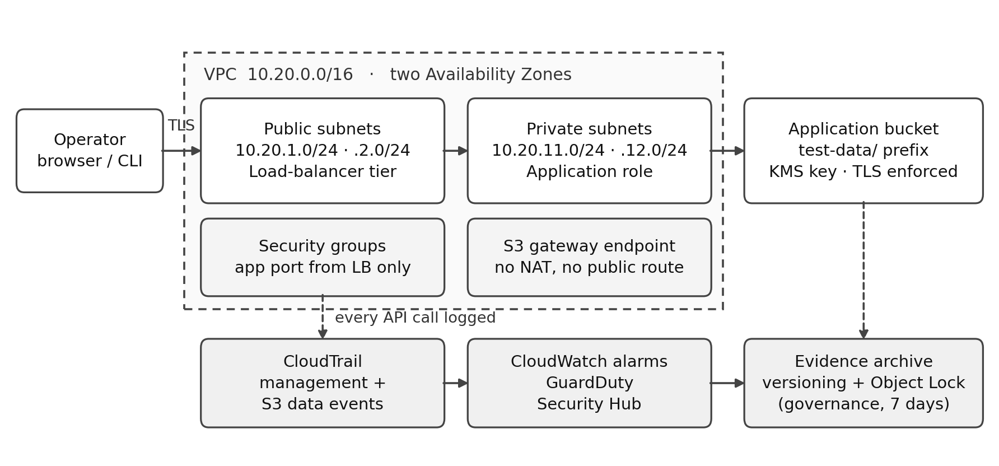

# AWS DevSecOps Baseline

A hardened, monitored AWS environment built with DevSecOps principles, together with a controlled attack simulation that verifies the detection chain end to end.

## What this project does

- Deploys a private VPC with public/private subnet separation across two Availability Zones.
- Enforces least-privilege IAM with MFA, scoped roles and a deliberately weak test identity.
- Protects data with SSE-KMS, block-public-access and a separate evidence archive using S3 Object Lock.
- Monitors all activity with CloudTrail, CloudWatch alarms, GuardDuty and Security Hub.
- Runs a controlled attack (credential access, defense evasion, persistence) inside the sandbox.
- Validates CloudTrail log integrity over the whole exercise window.

## Architecture

## Results

| Test | Result |
|---|---|
| Permitted S3 access | Pass |
| Prohibited S3 access | Access Denied |
| Failed-login alarm | Delivered |
| Log tampering | Blocked by Object Lock |
| Persistence attempt | Access Denied |
| CloudTrail log integrity | 13/13 digest files valid, 150/150 log files valid |
| Recovery time | 20 minutes 19 seconds |
| Pipeline checks | cfn-lint, gitleaks, checkov — all green |

## Repository structure

- `infra/` — CloudFormation templates
- `policies/` — redacted IAM policies
- `detection/` — CloudWatch metric filter definitions
- `tests/` — acceptance test script
- `docs/` — architecture diagram, scope record, exercise runbook
- `evidence/redacted/` — redacted exercise summary
- `.github/workflows/` — CI pipeline

## Deploy it yourself

See `docs/Beginner_Guide.md` for step-by-step instructions.

## What I would do differently

- Use a separate security account for the evidence archive.
- Automate response actions instead of manual investigation.
- Test multi-AZ failover with a second application instance.

## Licence

MIT
