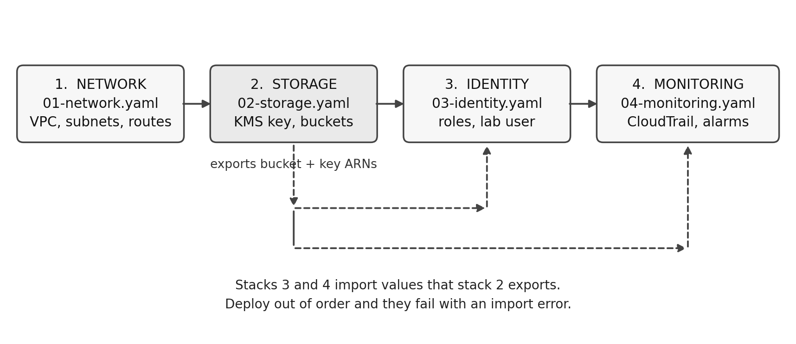
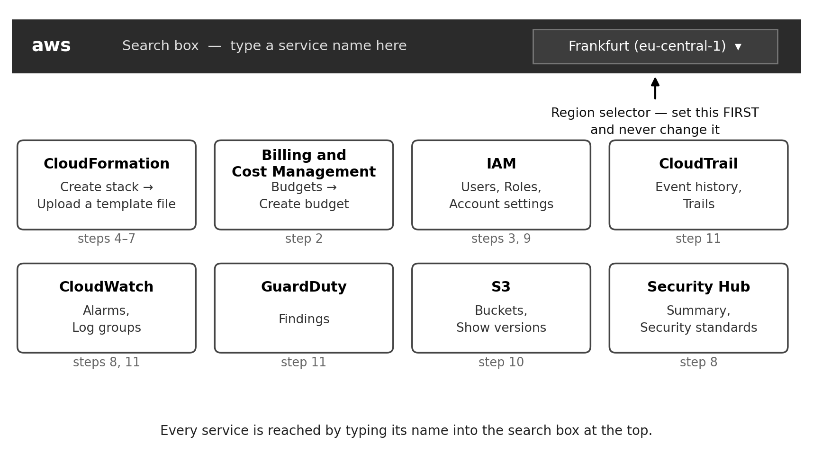
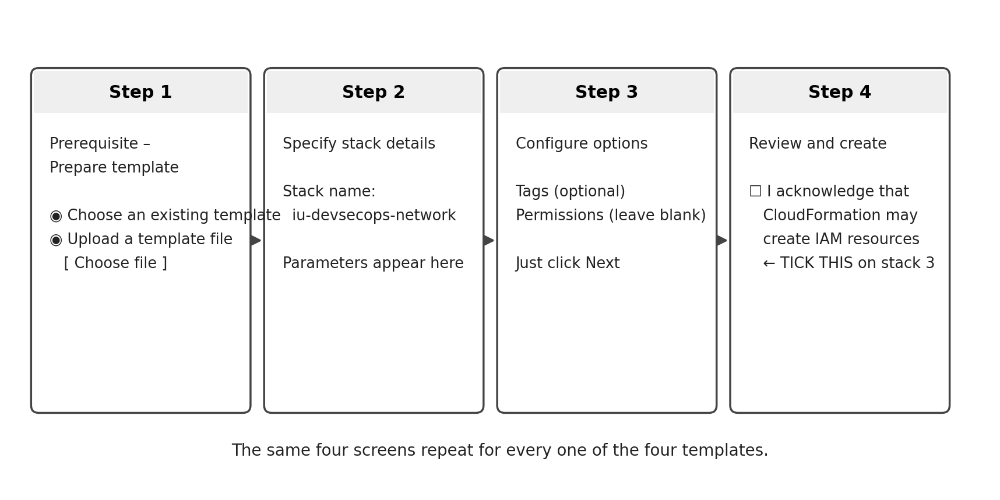

# Building the project — a complete beginner's guide

This guide assumes you have never opened the AWS console and are not comfortable with a command line. It tells you what to click, what to type, what should happen, and what to do when it doesn't.

Every step has a tag like **S6**. The same tag appears in the yellow markers inside `Project_Report_TEMPLATE.docx`. Finish a step, open the report, find that tag, replace the marker with what you produced. That is the whole method.

**Time:** about 25 hours spread over two to three weeks. Don't try to do it in a weekend — the alarms need time to fire and the billing figures need a day to appear.

**Cost:** under EUR 5 if you follow the cleanup steps. Step 2 sets a hard budget alert so you find out immediately if that changes.

> **A note on the pictures.** The diagrams in this guide are schematic drawings of the AWS console, not screenshots. AWS redesigns its interface regularly, so button positions shift; the *names* of things stay stable, and those are what the diagrams show you. If a button isn't where the drawing suggests, search for its name.

---

## Part 0 — What you are actually building, in plain words

You are renting a small piece of Amazon's data centre and configuring it so that even if an attacker steals a password, they can do very little and cannot hide what they did. Then you play the attacker yourself, in your own rented space, to check whether that is true.

Seven words you will meet constantly:

| Word | What it means here |
|---|---|
| **Region** | Which physical part of the world your resources live in. You pick one and stay in it. |
| **IAM** | The system that decides who can do what. Users, roles and permissions. |
| **VPC** | Your own private network inside AWS. Split into a public half and a private half. |
| **S3** | File storage. A "bucket" is a folder with a globally unique name. |
| **KMS** | The service that holds encryption keys. |
| **CloudTrail** | A recorder that writes down every action anyone takes in your account. |
| **CloudFormation** | Reads a text file describing resources and builds them for you. |

CloudFormation is the important one. Instead of clicking through forty screens, you hand AWS a file and it builds everything. That is what "infrastructure as code" means in Section 3 of your report, and it is why you can delete everything and rebuild it identically.



The four files must be deployed in that order. Stack 2 publishes the names of the bucket and the key; stacks 3 and 4 look those names up. Deploy them out of order and AWS refuses with an import error.

---

## Part 1 — Before you touch anything

### S1 · Create the GitHub repository
*Report markers filled: none yet, but the repository is needed from S2 onward.*

1. Go to github.com and sign in. Click the **+** at the top right → **New repository**.
2. Name it `aws-devsecops-baseline`. Select **Private**. Tick **Add a README file**. Under licence choose **MIT**. In the **.gitignore** dropdown choose **None** — you will use the one supplied in the zip, because no GitHub template ignores AWS credentials or raw log exports.
3. Click **Create repository**.
4. Click the green **Code** button, copy the HTTPS address.
5. Install Git if you don't have it (git-scm.com). Then open a terminal — **Git Bash** on Windows, **Terminal** on macOS — and run:

```bash
cd Documents
git clone <paste the address here>
cd aws-devsecops-baseline
```

6. Download `aws-devsecops-baseline.zip` and extract its contents **into this folder**. You should now see `infra/`, `tests/`, `docs/`, `deploy.sh`, `README.md` and a hidden `.gitignore`.

On Windows, hidden files are shown via **View → Hidden items** in Explorer; on macOS press **Cmd + Shift + .** in Finder. Check that `.gitignore` and `.github` actually arrived. The `.gitignore` is what stops you accidentally publishing a password.

7. Save your first version:

```bash
git add .
git commit -m "Add infrastructure templates"
git push
```

If Git asks for a password, it wants a **personal access token**, not your GitHub password: GitHub → Settings → Developer settings → Personal access tokens → Tokens (classic) → Generate new token, tick `repo`, copy it, paste it as the password.

### S2 · Create the AWS account and cap the spending
*Report markers filled: **1.1** (account alias, Region, dates) and part of **Chapter 3** (budget).*

1. Go to aws.amazon.com and click **Create an AWS Account**. You need an email address and a credit or debit card. AWS places a small temporary authorisation on the card and refunds it.
2. **Use an account that holds nothing else.** Step S9 creates a user with a deliberately weak password. If your existing account has anything real in it, make a second one with a different email (Gmail accepts `yourname+aws@gmail.com` as a separate address delivering to the same inbox).
3. Sign in as **root user** — the email address you just registered.
4. Set the Region. Top right of the screen, next to your account name, there is a Region selector. Choose **Europe (Frankfurt) eu-central-1**. From now on, check this selector every time you sign in. Resources created in one Region are invisible from another, and this causes more confusion for beginners than anything else in AWS.



5. Give the account a name that doesn't expose your account number. Search for **IAM**, and on the IAM dashboard find **Account Alias** on the right → **Create** → enter `iu-devsecops-lab`.
6. Protect the root user. IAM → **My security credentials** → **Multi-factor authentication (MFA)** → **Assign MFA device**. Choose **Authenticator app**, install Google Authenticator or Authy on your phone, scan the code, enter two consecutive codes. Do not skip this. The root user can do anything, including spending money without limit.
7. Set the budget. Search for **Billing and Cost Management** → **Budgets** → **Create budget** → **Customize (advanced)** → **Cost budget**. Period **Monthly**, budgeted amount **25 USD**. Add two alert thresholds at **40%** and **80%** of budgeted amount, each emailing you. Create.
8. Set a password policy. IAM → **Account settings** → **Password policy** → Edit. Minimum length 10, require at least three character types, prevent reuse of the last three passwords.

**Write in your notes now:** account alias, Region, today's date. These go into Section 1.1.

### S3 · Create your own admin user and install the CLI
*Report markers filled: none directly; produces the working identity everything else uses.*

Never work as root. Make yourself a normal administrator instead.

1. IAM → **Users** → **Create user**. Name `leo-admin`. Tick **Provide user access to the AWS Management Console**, choose **I want to create an IAM user**, set a custom password, untick "users must create a new password".
2. Next → **Attach policies directly** → search `AdministratorAccess` → tick it → Create user.
3. Open the new user → **Security credentials** → **Enable MFA**, same procedure as the root user.
4. Still on Security credentials → **Create access key** → choose **Command Line Interface (CLI)** → tick the acknowledgement → Create. You will see an **Access key ID** and a **Secret access key**. The secret is shown exactly once. Copy both somewhere safe now.
5. Install the AWS CLI: search for "AWS CLI installer" on aws.amazon.com and run the installer for your operating system. Then in a terminal:

```bash
aws configure
```

It asks four questions. Paste the access key ID, paste the secret access key, type `eu-central-1`, and type `json`.

6. Check it works:

```bash
aws sts get-caller-identity
```

You should see a twelve-digit account number and your user's name. If you see `Unable to locate credentials`, `aws configure` didn't save — run it again.

7. Sign out of root. Sign back in using the **IAM user** option, your account alias, and `leo-admin`.

---

## Part 2 — Build the environment



The next four steps are the same four screens every time. Search for **CloudFormation** → **Create stack** → **With new resources (standard)** → **Choose an existing template** → **Upload a template file** → **Choose file** → pick the YAML → Next.

**The stack names below must be typed exactly.** The test script finds your resources by looking up these names; a typo gives you empty results later.

### S4 · Deploy the network
*Report markers filled: part of **Appendix A1**.*

Upload `infra/01-network.yaml`. Stack name: `iu-devsecops-network`. Leave every parameter at its default. Next, Next, Submit.

Watch the **Events** tab. Status goes `CREATE_IN_PROGRESS` then `CREATE_COMPLETE` in about a minute. Click the **Outputs** tab and copy everything into a text file — you need `PrivateRouteTableId` and `AppSecurityGroupId` later.

What you just built: a private network split into a public half that can reach the internet and a private half that cannot, plus a doorway (the S3 gateway endpoint) letting the private half reach storage without going through the internet at all.

### S5 · Deploy the storage and encryption
*Report markers filled: **4.3**, **Appendix A2**.*

Upload `infra/02-storage.yaml`. Stack name: `iu-devsecops-storage`.

One parameter needs a value. **BucketSuffix** — lowercase letters, digits and hyphens, four to twenty characters. Use your initials and four digits, e.g. `ls4417`. S3 bucket names must be unique across every AWS customer on earth, so if the stack fails with `BucketAlreadyExists`, delete the stack, change the suffix, try again.

When it completes, open **Outputs** and note `AppBucketName`, `EvidenceBucketName` and `AppKeyArn`.

### S6 · Deploy the identity layer
*Report markers filled: **4.1**, **Appendix A1**.*

Upload `infra/03-identity.yaml`. Stack name: `iu-devsecops-identity`.

**LabUserPassword** — invent a password that satisfies your policy but is obviously guessable, such as `Sommer2026!`. You will describe it in the report as predictable, so never reuse a real one.

On the final review screen you must tick **"I acknowledge that AWS CloudFormation might create IAM resources with custom names."** The stack refuses to deploy without it. This is the one screen that differs from the other three.

### S7 · Deploy the monitoring
*Report markers filled: **4.4**, **Appendix A3**.*

Upload `infra/04-monitoring.yaml`. Stack name: `iu-devsecops-monitoring`. Enter your real email address for **AlertEmail**.

Within a minute AWS emails you asking to confirm a subscription. **Click the link.** Until you do, the subscription stays "Pending confirmation" and no alarm will ever reach you — which would make the detection test in S11 fail for a reason that has nothing to do with your security design. Verify by searching for **SNS** → Topics → your topic → Subscriptions; status must read `Confirmed`.

### S8 · Turn on the two chargeable services by hand
*Report markers filled: part of **4.4** (baseline posture).*

These are deliberately not in the templates, because they are the only parts that cost money — a few cents a day. Enable them now and disable them at S15.

1. Search for **Config** → **Get started** → leave the defaults → **Confirm**. This records what your resources look like. Security Hub cannot check most controls without it.
2. Wait ten minutes. Search for **Security Hub** → **Go to Security Hub** → enable **AWS Foundational Security Best Practices**.
3. Wait an hour, then open the Security Hub **Summary** page and write down how many controls **passed**, **failed** and were **not evaluated**. That is your baseline posture figure for Section 4.4.

---

## Part 3 — Prove the monitoring actually works

### S9 · Test the detection chain before you attack anything
*Report markers filled: **4.4**, **Appendix B**, **Appendix A3**.*

An enabled alarm is not a working alarm. Prove the whole chain first.

1. Open a **private/incognito browser window** so you stay signed in as admin in your normal window.
2. Go to `https://iu-devsecops-lab.signin.aws.amazon.com/console`.
3. Sign in as `iu-devsecops-lab-lab-weak-user` with a **deliberately wrong** password. Do this **six times**, noting the exact clock time in UTC of the first attempt.
4. Wait up to fifteen minutes. You should receive an email from your SNS topic.
5. Record three timestamps: the time of the first failed attempt, the time the alarm changed state (CloudWatch → Alarms → your alarm → History), and the time the email arrived.

If no email arrives, work through this in order: is the SNS subscription `Confirmed`? Is there a log group called `/aws/cloudtrail/iu-devsecops` with events in it? Does CloudWatch → Log groups → your group → **Metric filters** show three filters? Is the alarm in `OK` rather than `INSUFFICIENT_DATA`?

**Do not continue until an email arrives.** Everything after this depends on it.

---

## Part 4 — The controlled exercise

You are about to behave like an attacker inside your own account. This is legitimate because you own every resource involved and you will restore all of it. It would not be legitimate anywhere else.

### S10 · Record the starting state
*Report markers filled: **Appendix A4**.*

Create `docs/runbook-exercise.md` in your repository and write down: today's date, the time you are starting in UTC, the Git commit hash (`git rev-parse --short HEAD`), and how you will get back in if you lock yourself out (answer: you are still signed in as `leo-admin` in your main browser window, and the root user is your final fallback).

Then create something sacrificial to attack — an object you are happy to destroy:

```bash
echo "disposable" > /tmp/sacrificial.txt
aws s3 cp /tmp/sacrificial.txt s3://iu-devsecops-app-<suffix>/test-data/sacrificial.txt \
  --sse aws:kms --sse-kms-key-id alias/iu-devsecops-app-key
```

### S11 · Run the three stages
*Report markers filled: **5.2**, **Appendix A4**.*

Write down the UTC time of every single action. Precision here is what makes Section 5.2 credible.

**Stage 1 — credential access.** In the incognito window, sign in as the lab user with wrong passwords **seven times**, then once with the correct password. You are now "the attacker". This tests what the event log shows, not how strong the password is; stop at once if AWS presents any challenge or block.

**Stage 2 — defense evasion.** As the lab user, try to destroy the evidence:

- In S3, open the app bucket, select `sacrificial.txt`, click **Delete**. Note whether it succeeds.
- Open the **evidence** bucket and try to delete anything inside `AWSLogs/`. Note the exact error.
- Search for **CloudTrail** → your trail → try **Stop logging**. Note the exact error.

Two of those three must fail. If all three succeed, your permissions are wrong — record that honestly, fix it, and describe the fix in Section 6.2. That finding is worth more marks than a clean run.

**Stage 3 — persistence.** As the lab user, go to IAM → Users → **Create user** and try to make a second administrator. Note what happens at each click.

After each stage, check CloudWatch → Alarms and GuardDuty → Findings. **Record honestly whether GuardDuty produced a real finding.** A short exercise like this often produces none, and that is a legitimate result your report already explains. Do not generate sample findings and present them as detections — they are labelled as samples and carry invented data.

### S12 · Reconstruct what happened
*Report markers filled: **Figure 2**, **Appendix A4**.*

Sign back in as `leo-admin`.

1. Search for **CloudTrail** → **Event history**. Set the time range to your exercise window. Filter by **User name** = your lab user.
2. Export to CSV (**Download events**). Save it to `evidence/raw/` — that folder is gitignored, so it stays off GitHub.
3. Open the CSV and build a table with one row per action: time (UTC), user, source IP, event name, error code.
4. Apply three rules as you read it:
   - **An event name is not proof of success.** Look at the error code column. `CreateUser` appearing means it was *attempted*.
   - **A created user is not usable access.** Did it also get a password or an access key? If not, there is no working persistence.
   - **An IP address is not a person.** It identifies a connection, nothing more.
5. Check the evidence survived: S3 → evidence bucket → toggle **Show versions**. A "delete marker" hides the current view of an object without destroying the version underneath — so count versions, not filenames.
6. Validate the log signatures:

```bash
aws cloudtrail validate-logs --trail-arn <TrailArn from the S7 outputs> \
  --start-time 2026-09-02T00:00:00Z
```

7. Turn your table into a simple timeline picture. Draw it at draw.io (free, no account needed): a horizontal line, your events as points along it, attacker actions below the line and detections above. Export as PNG, about 165 mm wide and 65 mm tall, into `docs/timeline.png`. **Blur or delete your account number and IP address before you use it.**

---

## Part 5 — Measure, evaluate and clean up

### S13 · Run the acceptance tests
*Report markers filled: **Table 4**, **6.1**, **6.2**.*

```bash
cd aws-devsecops-baseline
bash tests/acceptance.sh
```

It prints PASS, FAIL or SKIP for each test and writes the raw output into `evidence/raw/`. Copy each result into the **Observed result** column of Table 4.

**Never write PASS for a test you did not run.** Write `Not tested`. A tutor can tell the difference between an honest gap and an invented pass, and only one of them costs you marks.

For each alarm separately, record the delay between the source event and the email. Keep the three individual figures; do not average them. Three observations do not support an average.

### S14 · Recover, and time how long it takes
*Report markers filled: **6.1** (recovery time), **Appendix A5**.*

Start a stopwatch.

1. IAM → Users → lab user → Security credentials → **Console access: Disable**.
2. Delete any user created during Stage 3.
3. Re-run `bash tests/acceptance.sh`. Permitted things must work, forbidden things must still fail.
4. Stop the stopwatch when that retest passes. That is your recovery time.

### S15 · Export evidence, then delete everything
*Report markers filled: **Chapter 3** (hours and cost), **Appendix A5**.*

**Export first — deletion is irreversible.**

```bash
aws s3 sync s3://iu-devsecops-evidence-<suffix> ./evidence/raw/archive/
```

Then:

```bash
bash teardown.sh
```

Disable Security Hub and AWS Config by hand in the console. Check **Billing → Bills** the next day and write down the actual cost. Also write down the hours you actually spent per stage against the plan of 3 / 7 / 6 / 4 — the difference, and why, goes into Chapter 3.

The evidence bucket survives deliberately: Object Lock blocks deletion until the seven-day retention expires. Come back in a week and delete it manually.

### S16 · Add the pipeline checks and verify citations
*Report markers filled: **6.3**, and the highlighted book citations throughout.*

The workflow file is already in `.github/workflows/`. Push anything and it runs. Open the **Actions** tab on GitHub and read the result.

Expect it to find things. Record what it flagged and what you changed — that is exactly what the Section 6.3 marker asks for. One known warning (`W1011`, about the password parameter) is genuine and explainable; don't silently suppress it.

**Then verify the six book citations.** I could not open these two books, so every page number in them is unverified and highlighted in the template:

| Citation | Claim it supports |
|---|---|
| Dotson, 2019, p. 2 | The cloud perimeter dissolves; resources change constantly |
| Dotson, 2019, p. 3 | Most incidents come from customer misconfiguration |
| Dotson, 2019, p. 11 | Defence in depth: independent layers |
| Dotson, 2019, p. 45 | Almost every cloud action is an authenticated API call |
| Dotson, 2019, p. 46 | Weak permissions are the most exploited weakness |
| Shostack, 2014, p. 61 | The six STRIDE categories |

Borrow both books through the IU library, find each claim, and correct the page number. If you cannot get the books, remove them from the reference list and cite something you can actually read — a reference you have not opened is a citation error regardless of whether the page number happens to be right.

The other citations use section locators (`Rose et al., 2020, Section 2.1`), which you can confirm in seconds: all the NIST documents are free PDFs, so open them and search for the heading.

### S17 · Finish the report
*Report markers filled: title page, front matter, all remaining markers.*

1. Replace every yellow marker with real content.
2. Insert both figures, each at full text width and about 65–75 mm tall.
3. Fill in tutor name and submission date on the title page.
4. Select all (**Ctrl + A**), press **F9**, choose **update entire table** — this fills the table of contents.
5. Type the real page numbers into the lists of figures, tables and appendices.
6. Select all again, and set text highlight colour to **No Color**.
7. Search the document for `[S` to confirm no marker survived.
8. Delete the "Working notes" page.
9. Confirm Chapter 1 to Chapter 7 occupies **7 to 10 pages**. Over? Shrink the figures first.
10. Submit through myCampus with the electronic affidavit.

### S18 · Make the repository worth showing an employer
*Report markers filled: none — this is for your job search.*

1. Check nothing sensitive is in the history: `git log -p | grep -E "[0-9]{12}"`. If it finds your account number, start a clean repository rather than trying to rewrite history.
2. Make it public.
3. Rewrite the README so a hiring manager understands it in sixty seconds: one-line description, the architecture diagram, a **Results** section with your real Table 4 outcomes and measured detection delays, and a "what I'd do differently" section.
4. Add topics: `aws`, `devsecops`, `cloud-security`, `iam`, `cloudtrail`, `infrastructure-as-code`.
5. Pin it on your GitHub profile.
6. **Do not publish the report.** IU holds copyright on submissions. Publish the code, the diagram and the results.

---

## When something goes wrong

| Symptom | Cause | Fix |
|---|---|---|
| `BucketAlreadyExists` | Someone worldwide has that bucket name | Delete the stack, change BucketSuffix, redeploy |
| `Export ... cannot be found` | Stacks deployed out of order | Delete and redeploy in the order 1, 2, 3, 4 |
| `requires capabilities: [CAPABILITY_NAMED_IAM]` | Checkbox on the last screen not ticked | Redeploy stack 3 and tick it |
| No alarm email ever arrives | SNS subscription never confirmed | SNS → Topics → Subscriptions; must read `Confirmed` |
| Console shows nothing you created | Wrong Region | Check the Region selector, top right |
| `Unable to locate credentials` | `aws configure` not completed | Run `aws configure` again |
| Stack stuck in `DELETE_FAILED` | Bucket still has objects in it | `aws s3 rm s3://<bucket> --recursive`, then retry |
| Everything in Stage 2 succeeded | Permissions too broad | Record it, fix the policy, write it up in 6.2 |

## Marker index

| Tag | Report location | What it needs |
|---|---|---|
| S2 | 1.1, Chapter 3 | Account alias, Region, dates, budget |
| S4 | Appendix A1 | Network outputs |
| S5 | 4.3, Appendix A2 | Bucket names, key, storage test results |
| S6 | 4.1, Appendix A1 | Policy exports, allowed and denied calls |
| S7 | 4.4, Appendix A3 | Trail and alarm configuration |
| S8 | 4.4 | Baseline posture counts |
| S9 | 4.4, Appendix B | End-to-end alert test and timestamps |
| S10 | Appendix A4 | Scope, start time, commit hash |
| S11 | 5.2, Appendix A4 | What happened at each stage, in UTC |
| S12 | Figure 2, Appendix A4 | Timeline picture, digest validation |
| S13 | Table 4, 6.1, 6.2 | Observed results, detection delays |
| S14 | 6.1, Appendix A5 | Recovery time |
| S15 | Chapter 3, Appendix A5 | Actual hours and cost |
| S16 | 6.3, book citations | Pipeline findings, verified page numbers |
| S17 | Title page, front matter | Tutor, date, TOC, page numbers |
| S18 | — | Repository polish |

Figure 1 in the report is the architecture diagram, already supplied as `docs/architecture.png`. Insert it at S17 unless you changed the design, in which case redraw it.
